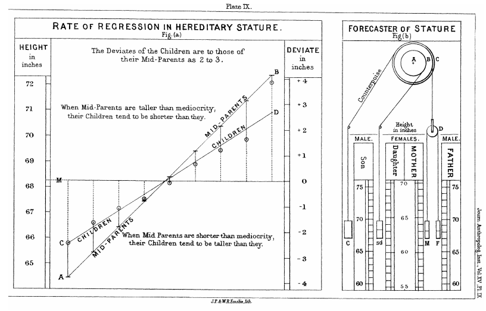

# ML - Linear Regression

This repo contain a Jupyter Notebbok that present an overview and implement a version, using Numpy, of Linear Rregression.

The Jupyter Notebook is in this <a href='./notebooks/ml_linear_regression.ipynb'>link</a>.

For run the Jupyter Notebook online, on Binder, click here 

 

  

 